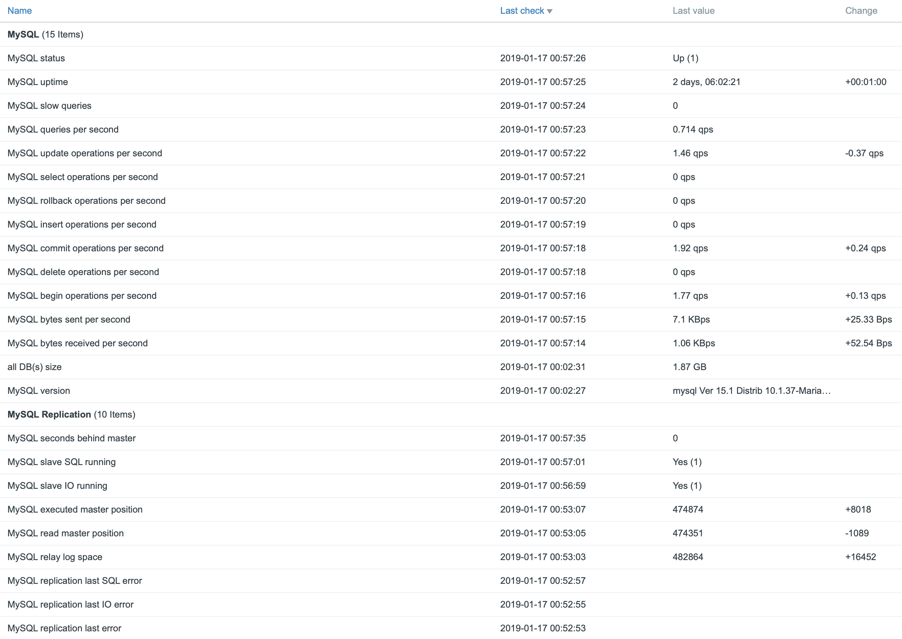

# Zabbix Template for MySQL with replication

- Based on the official Zabbix MySQL template
- Uses Zabbix agent user parameters (passive checks)
- The "{$DB_NAME}" macro and "mysql.size[{$DB_NAME}]" key can be used to monitor all (or specific) DB size
- Template has several triggers. Zabbix will generate a problem if MySQL or slave isn't running

## Configuration
1. Install and configure Zabbix agent (https://www.zabbix.com/download)

2. Backup and remove existing user parameters in the file
```
> /etc/zabbix/zabbix_agentd.d/userparameter_mysql.conf
```

3. Provide MySQL credentials and set correct permissions (example for Ubuntu)
```
cat /etc/mysql/debian.cnf
[client]
user     = debian-sys-maint
password = Password^$76u75

chmod 640 /etc/mysql/debian.cnf
chown root:zabbix /etc/mysql/debian.cnf
```

4. Add required user user parameters. Mind, it is an example. You can use default user parameters with minor changes to get the same information.
```
# Flexible parameter to determine database or table size. On the frontend side, use keys like mysql.size[zabbix,history,data].
# Key syntax is mysql.size[<database>,<table>,<type>]. # Database may be a database name or "all". Default is "all". # Table may be a table name or "all". Default is "all". # Returns value in bytes.
UserParameter=mysql.size[*],bash -c 'echo "select sum($(case "$3" in both|"") echo "data_length+index_length";; data|index) echo "$3_length";; free) echo "data_free";; esac)) from information_schema.tables$([[ "$1" = "all" || ! "$1" ]] || echo " where table_schema=\"$1\"")$([[ "$2" = "all" || ! "$2" ]] || echo "and table_name=\"$2\"");" | /usr/bin/mysql --defaults-extra-file=/etc/mysql/debian.cnf -N'

# MySQL version and status
UserParameter=mysql.ping,mysqladmin --defaults-extra-file=/etc/mysql/debian.cnf ping | grep -c alive
UserParameter=mysql.version,mysql --defaults-extra-file=/etc/mysql/debian.cnf -V

# Flexible parameter to grab global variables. On the frontend side, use keys like mysql.status[Com_insert].
UserParameter=mysql.extended_status[*],/usr/bin/mysqladmin --defaults-extra-file=/etc/mysql/debian.cnf extended-status variables |awk {'print $$2"| "$$4'} | grep "$1|" | awk {'print $$2'}

# Replication monitoring
UserParameter=mysql.slave_lagging,/usr/bin/mysql --defaults-extra-file=/etc/mysql/debian.cnf -Bse "show slave status\\G" | grep Seconds_Behind_Master | awk '{print $$2}' | sed -e 's/^NULL$/-1/; s/![0-9]+/-1/' | awk '{if($2 ~ /d/) {print 100} else {print $2}}'

UserParameter=mysql.slave_status[*],/usr/bin/mysql --defaults-extra-file=/etc/mysql/debian.cnf -e "show slave status\\G"|grep -i $1 | awk '{print $$2}'
```

5. Restart Zabbix agent and test commands
```
systemctl restart zabbix-agent

zabbix_agentd -t "mysql.slave_status[Slave_SQL_Running]"
zabbix_agentd -t "mysql.extended_status[Com_delete]"
```

6. Import template, review and link it to a MySQL server

7. Result

